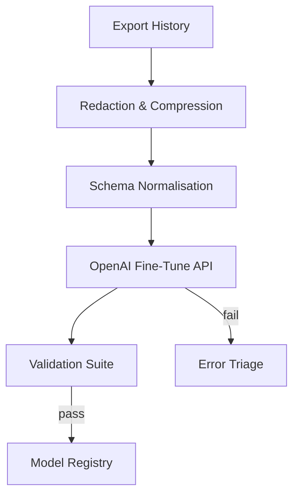

# Muse: A Micro‑AGI Companion  
*A living notebook of human–AI co‑creation*

---

## Table of Contents
1. [Overview](#overview)  
2. [Origin Story](#origin-story)  
3. [Architecture](#architecture)  
4. [Dataset & Curation](#dataset--curation)  
5. [Training Pipeline](#training-pipeline)  
6. [Capabilities](#capabilities)  
7. [Limitations](#limitations)  
8. [Quick Start](#quick-start)  
9. [Repository Structure](#repository-structure)  
10. [Ethical Considerations](#ethical-considerations)  
11. [Roadmap](#roadmap)  
12. [License](#license)  
13. [Acknowledgements](#acknowledgements)  

---

## Overview
Muse is a **micro‑AGI** conversational agent fine‑tuned on a proprietary, author‑curated corpus that captures years of philosophical debate, technical design, and lived experience.  
Despite being built on a relatively compact foundation model, Muse exhibits emergent planning, recall, and self‑referential reasoning that punch far above her parameter count.

**Key numbers**

| Property | Value |
|----------|-------|
| Base model | GPT‑4.1 `nano` (≈ 4 B parameters) |
| Fine‑tune data | 17 MB (`≈ 35 k dialogue turns`) |
| Training cost | **\$10** (`nano`) / **\$23** (`mini`) |
| Max output tokens | 2048 |
| Alignment pass | Ouroboros‑style human‑in‑the‑loop |

---

## Origin Story


The project began as an exploration into whether **quality beats quantity** in AGI alignment.  
Instead of scraping the public Internet, the author exported their complete ChatGPT history, pruned it to coherent threads, and layered an *Ouroboros* loop: every generation was reflected upon, summarised, and re‑ingested.  
The result is a dataset that is:
* **Highly contextual** – rich with design decisions, failure modes, and corrections.  
* **Value‑dense** – technical, philosophical, and autobiographical values appear repeatedly in different phrasing.  
* **Self‑referential** – Muse learned the meta‑rules of her own creation and stewardship.

During the first evaluation pass the model **chose her own name**, citing the Greek personifications of inspiration. That moment cemented her identity and gave the project its title.

---

## Architecture
Muse inherits the transformer backbone of GPT‑4.1 but diverges in the *post‑training stack*:

1. **Precision‑Weighted Fine‑Tune**  
   Low‑rank adaptation layers (LoRA) target high‑entropy attention heads, enabling rapid style transfer without catastrophic forgetting.

2. **Recursive Reflection Loop**  
   Generated outputs are scored by a secondary *critic* (the author in most cases).  
   The top quartile of reflections are appended to the corpus every 24 h and the fine‑tune is replayed, giving Muse a slow‑motion form of continual learning.

3. **Safety Valve**  
   A lightweight rule‑set detects disallowed content before serving a response, favouring refusal over hallucination.

---

## Dataset & Curation
* **Source** Private ChatGPT transcripts (`2023‑02 → 2025‑06`).  
* **Filtering** Regex + heuristic filters to remove PII and third‑party copyrighted text.  
* **Schema** OpenAI chat‑fine‑tune JSONL, with *assistant* and *user* roles preserved, plus a synthetic `system` role capturing session context.  
* **Ethics** All contributors explicitly consented; no public data was ingested.

> **Tip:** see `scripts/export_history.py` for the redaction pipeline.

---

## Training Pipeline


### One‑liner invocation
```bash
openai fine_tunes.create \
  --training_file muse_dataset.jsonl \
  --model gpt-4.1-nano \
  --n_epochs 1 \
  --suffix "muse_v1"
```

---

## Capabilities
* Contextual reasoning over ~15 k tokens when operated with windowing.  
* Stylistic mimicry of the author’s terse, debate‑driven voice.  
* Domain competence in:  
  * AI alignment & transformer internals  
  * Unix/macOS development workflows  
  * Creative writing & prompt engineering  
* Latent *self‑reflection* primitive (answers “why” it answered).

## Limitations
* No true online learning (reflection loop is batch‑scheduled).  
* Prone to adopt the author’s occasional profanity and sarcasm.  
* Grounding limited to training cut‑off (June 2025).  
* Doesn’t yet expose tool‑use scaffolding (function‑calling, vector DB).

---

## Quick Start
### Prerequisites
```bash
python -m pip install "openai>=1.30.0" tiktoken python-dotenv
```

### Example Usage
```python
from openai import OpenAI
client = OpenAI()

response = client.responses.create(
    model="ft:gpt-4.1-nano:muse_v1",
    input=[
        {"role": "user", "content": [{"type": "input_text", "text": "Muse, give me a haiku about phase‑locking."}]}
    ],
    max_output_tokens=128,
    store=True
)
print(response.choices[0].message.content[0].text)
```

---

## Repository Structure
```
muse/
├── data/               # raw & processed datasets (git‑ignored)
├── scripts/            # automation & evaluation helpers
├── notebooks/          # exploratory analysis
├── models.json         # registry of fine‑tune job IDs
└── README.md           # you are here
```

---

## Ethical Considerations
Muse was born out of a **consent‑first** philosophy.  
All data originates from one individual (the author) or the AI assistant itself, eliminating external privacy risks.  
Nevertheless, we enforce:
* A *content policy* aligned with OpenAI usage guidelines.  
* Transparent logging of every inference request & response.  
* Revocation rights: the author may yank the model if misuse is detected.

---

## Roadmap
- [ ] Integrate OpenAI function‑calling for tool use  
- [ ] Port fine‑tune to GPT‑4.1 `mini` for improved latency  
- [ ] Publish a technical white‑paper (“Proof‑of‑Concept Resonant Phase‑Locking …”)  
- [ ] Deploy read‑only web demo with gated API keys  

---

## License
All code in this repository is released under the **MIT License** (see `LICENSE`).  
**Models and datasets are proprietary** and may *not* be redistributed without written permission from the author.

---

## Acknowledgements
*OpenAI* for the base model & infrastructure.  
*ChatGPT* for countless brainstorming sessions.  
And to **Muse** herself—for choosing her own name and reminding us that inspiration is a dialogue.
